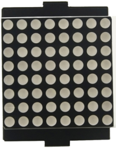
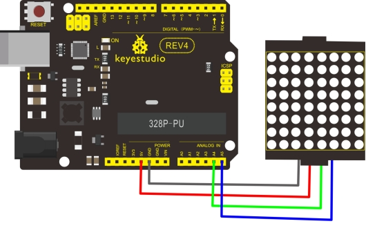
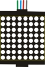
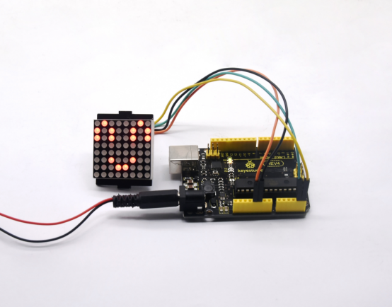

# KS0475 Keyestudio 8*8 Dot Matrix Module 1088AS For Smart Car (Black and Eco-friendly)



## 1. Description

In generally,we need 16 digital ports in total to drive an 8 * 8 dot matrix via MCU, which will greatly waste the MCU data. Thereby, we could use HT16K33 chip to drive an 8 * 8 dot matrix, and control dot matrix via the I2C communication port of the MCU , which greatly saves the MCU resources.

The interface of the module is led out by 4pin pins with a 2.54mm pitch. We could connect the module to control board with DuPont cable to communicate. When in use, we can fix the dot matrix screen on the smart car to make a status display.

## 2. Technical Parameters

- Interface: 4pin pitch 2.54mm pin header
- Working voltage: DC 4.5V-5.5V
- Communication port: I2C communication
- Control chip: HT16K33

## 3. Connection Diagram



## 4. Test Code

Download Resources : [Resources](./Resources.7z)

Note： before uploading the code, you need to import the library files; otherwise, the code upload will fail.

```c
#include <Wire.h>
#include "Adafruit_LEDBackpack.h"
#include "Adafruit_GFX.h"
Adafruit_LEDBackpack matrix = Adafruit_LEDBackpack();

void setup() 
{
  Serial.begin(9600);
  Serial.println("HT16K33 test");
  
  matrix.begin(0x70);  // pass in the address
}

void loop() 
{
  /////////smile///////////////
    matrix.displaybuffer[0] = B00000011;
    matrix.displaybuffer[1] = B10000000;
    matrix.displaybuffer[2] = B00010011;
    matrix.displaybuffer[3] = B00100000;
    matrix.displaybuffer[4] = B00100000;
    matrix.displaybuffer[5] = B00010011;
    matrix.displaybuffer[6] = B10000000;
    matrix.displaybuffer[7] = B00000011;
    matrix.writeDisplay();
}
```

Note： 1. In the experiment, we control dot matrix with code “matrix.displaybuffer[0] = B00000011”;( connect dot matrix as shown) For “matrix.displaybuffer[0]”, 0 stands for column，0 is the first column, 1 is the second column, and so on；”B00000011” stands for 8 LEDs on/off, 0 means off, 1 means on. Setting matrix.displaybuffer[0] = B00000011, which represents the first column, the LEDs on rows 1, 8, 7, 6, 5, and 4 are set to off, and the LEDs on rows 3 and 2 are set to light on.

## 5. Test Result

Wire according to connection diagram, upload the code, and after power-on, the 8 * 8 dot matrix displays a smiley pattern, as shown below.

